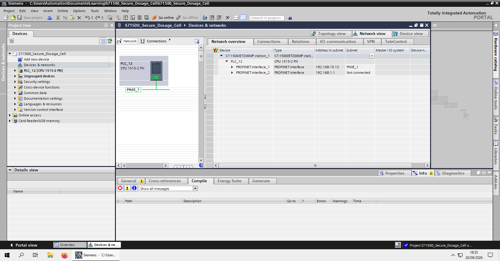
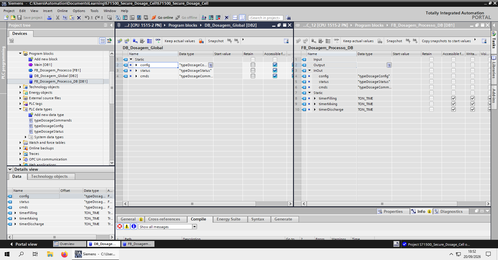
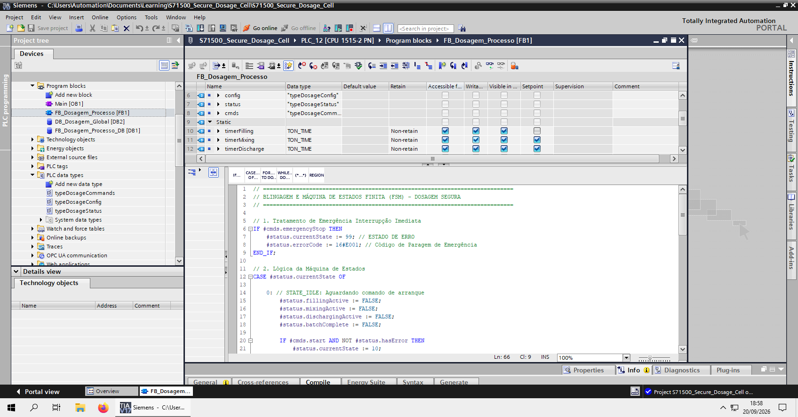

# S7-1500 Secure Dosage Cell (TIA Portal V17)

Repositório de referência para automação industrial, estruturação de blocos de controle baseados em UDTs, Máquinas de Estados (FSM) e implementação de comunicação segura (*Security by Design*) utilizando Siemens S7-1500 e OPC UA.

---

## 🏗️ 1. Arquitetura do Sistema e Topologia

O projeto simula uma célula de dosagem industrial de alta precisão, projetada com foco em modularidade, reusabilidade de código e conformidade com padrões de cibersegurança industrial (IEC 62443).

* **Controlador:** Siemens SIMATIC S7-1500 (CPU 1515-2 PN)
* **Ambiente de Desenvolvimento:** TIA Portal V17
* **Protocolo de Comunicação:** OPC UA (com criptografia e autenticação ativadas)

---

## 📁 2. Estrutura de Blocos e Dados

A arquitetura de software foi modularizada utilizando User Defined Types (UDTs) para garantir o encapsulamento de dados e facilidade de manutenção:

* **UDTs:**
  * `typeDosageConfig`: Parâmetros operacionais e setpoints de dosagem.
  * `typeDosageStatus`: Telemetria de processo, diagnósticos e erros.
  * `typeDosageCommands`: Comandos de controle manual/automático.
* **Function Block (`FB_Dosagem_Processo`):** Implementa a Máquina de Estados Finita (FSM) que rege as fases de *IDLE*, *FILLING*, *DOSING*, *DRAINING* e *FAULT*.
* **Data Block Global (`DB_Dosagem_Global`):** Instância estática exposta de forma controlada ao servidor OPC UA.

---

## 📷 3. Evidências Visuais (TIA Portal V17)

### Visão Geral da Arquitetura e Devices

### Organização de Blocos e UDTs

### Lógica da Máquina de Estados (FSM)

---

## 🔒 4. Cibersegurança Industrial & OPC UA (*Security by Design*)

Para mitigar riscos de exposição em redes OT, o servidor OPC UA interno da CPU S7-1500 foi configurado com:
* **Autenticação de Usuário:** Credenciais restritas baseadas em papéis (`admin_ot`).
* **Criptografia de Canal:** Perfil de segurança robusto (`Basic256Sha256`).
* **Isolamento de Endpoint:** Validação de certificados e controle rigoroso de nós expostos na árvore de endereçamento.

---

## 🐍 5. Integração e Monitoramento (Python / Client)

O repositório inclui um exemplo de cliente em Python (`opcua_client.py`) utilizando a biblioteca `asyncua` para leitura assíncrona dos nós de estado do CLP.
